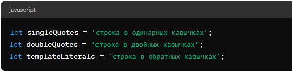
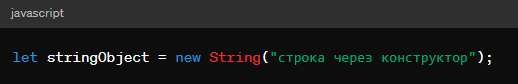
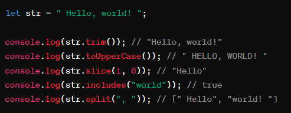
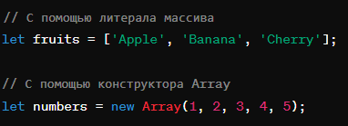
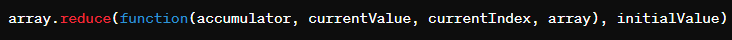
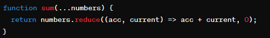
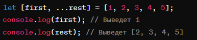
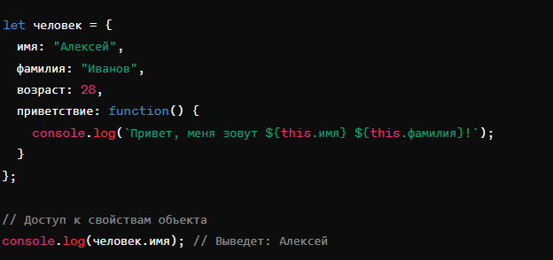
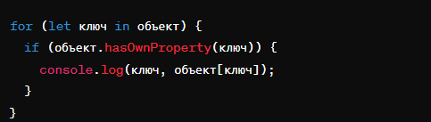
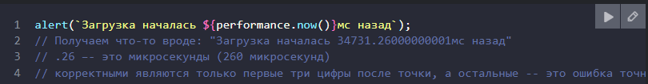

# FirstLecture

## JavaScript

(JS) является динамическим языком программирования. Термин "динамический" в контексте языков программирования обычно относится к нескольким ключевым характеристикам:

## Динамическая типизация

В JavaScript тип переменной определяется во время выполнения программы, а не заранее при её объявлении. Это означает, что переменные могут принимать значения различных типов данных в разное время. Например, переменная, которая сначала содержала строку, может позже хранить число, объект или любой другой тип данных.

## РОЛЬ JAVASCRIPT В ВЕБ-РАЗРАБОТКЕ

JavaScript (JS) – это язык программирования, который играет ключевую роль в современной веб-разработке. Он используется для создания интерактивных веб-страниц и веб-приложений, которые могут реагировать на действия пользователя и динамически обновлять контент.

### для объявления переменных используются ключевые слова

- var
- let
- const

var - (устаревший, избегайте его использования) (внутри функции или глобальная для всего скрипта).

let- Область видимости: Блоковая (внутри блока кода, например, внутри функции или цикла).Нет, нельзя снова объявить переменную с тем же именем в том же блоке.В JavaScript существуют два основных типа данных:

const-Область видимости: Блоковая (внутри блока кода, например, внутри функции или цикла).
Возможность повторного объявления: Нет, нельзя снова объявить переменную с тем же именем в том же блоке.
Возможность изменения значения: Нет, значение переменной нельзя менять после ее объявления.

### В JavaScript существуют два основных типа данных:

- Примитивы:
- объект

#### Примитивы:

- boolean (булево): true или false.
- number (число): целое или дробное.
- string (строка): текст.
- null: отсутствие значения.
- undefined: неопределенное значение.
- symbol: уникальный неизменяемый тип.

#### объект:

- object (объект): коллекция ключей и значений.
- array (массив): упорядоченная коллекция значений.
- function (функция): код, который можно выполнить.

##Операторы в JavaScript

Операторы - это специальные символы или слова, которые используются для выполнения операций над значениями. JavaScript имеет богатый набор операторов, которые можно разделить на несколько категорий:

- Арифметические операторы:
- Логические операторы:
- Операторы присваивания:
- Операторы инкремента и декремента:
- Операторы цикла:

  # Три важные темы в JS

- Условия
- Циклы
- Фуекция

#### Условия

В JavaScript используются различные конструкции для проверки условий и выполнения различных действий в зависимости от результата проверки.

Основные конструкции:

- if
- if eles
- switch
- Тернарный оператор:
- Логические операторы:

#### Циклы

Циклы используются для многократного выполнения кода.

Существуют следующие виды циклов:

- for
- while
- do...while

#### Фуекция

Функции являются одними из основных строительных блоков JavaScript. Они позволяют группировать код, который можно вызывать по имени, предоставляя возможности повторного использования, структурирования и модульности.

Функции в JavaScript
Функции являются одними из основных строительных блоков JavaScript. Они позволяют группировать код, который можно вызывать по имени, предоставляя возможности повторного использования, структурирования и модульности.

Основные понятия:
Объявление: Используется ключевое слово function для объявления функции. Имя функции выбирается вами.
Параметры: Функции могут принимать параметры, которые представляют собой входящие данные для функции.
Тело функции: Это блок кода, который выполняется при вызове функции.
Возвращаемое значение: Функции могут возвращать значения с помощью ключевого слова return.

три вид функции в js

- FUNCTION Declaration
- FUNCTION expression
- FUNCTION iife

  # рекурсия

javascript имеет свойство, которое называется рекурсией - это способ написания программы таким образом, чтобы она сама себя вызывала.
Функция, которая в своем теле вызывает сама себя, называется рекурсивной функцией.

function factorial(n){
if (n === 1){ (АГАР МО АМИНЧАДА УСЛОВИЯ НАТИЕМ ФУЕКЦМОН БИСКАНЧЕНИ МЕРАВАОД)
return 1; (ИЧАДА УЛОВА АГАР БА 1 БАРАОБА ШУД АМИН РИТУРН ФУНКЦАРО МАХКАМ МЕКНАД)
}
else{

        return n * factorial(n - 1) ( АРУД ИД ОСНАВНЙ КОД  КОР КИХТ   n * factorial(n - 1) ДАМ N -1 ИВИ КАМ КИХТ ТО ПИТИР УСЛОВИ ЕЦ );
    }

}
const result = factorial(4); (ЮДЕ Я АР МАМ РЕЗАЛТ ПЕРМЕН ИД ФУНКЦ ВЕВЧЕН)
console.log(result)

### Рекурсивный способ: упрощение задачи и вызов функцией самой себя:

Обратите внимание, что рекурсивный вариант отличается принципиально.

Когда функция pow(x, n) вызывается, исполнение делится на две ветви:

# Замыкания

##### (Замыкание — это комбинация функции и лексического окружения, в котором эта функция была определена. Другими словами, замыкание даёт вам доступ к Scope (en-US) внешней функции из внутренней функции. В JavaScript замыкания создаются каждый раз при создании функции, во время её создания.)

init() создаёт локальную переменную name и определяет функцию displayName(). displayName() — это внутренняя функция — она определена внутри init() и доступна только внутри тела функции init(). Обратите внимание, что функция displayName() не имеет никаких собственных локальных переменных. Однако, поскольку внутренние функции имеют доступ к переменным внешних функций, displayName() может иметь доступ к переменной name, объявленной в родительской функции init().

Причина в том, что функции в JavaScript формируют так называемые замыкания. Замыкание — это комбинация функции и лексического окружения, в котором эта функция была объявлена. Это окружение состоит из произвольного количества локальных переменных, которые были в области действия функции во время создания замыкания. В рассмотренном примере myFunc — это ссылка на экземпляр функции displayName, созданной в результате выполнения makeFunc. Экземпляр функции displayName в свою очередь сохраняет ссылку на своё лексическое окружение, в котором есть переменная name. По этой причине, когда происходит вызов функции myFunc, переменная name остаётся доступной для использования и сохранённый в ней текст "Mozilla" передаётся в alert.

# строк

В JavaScript, String — это глобальный объект, который используется для работы со строками. Строка — это последовательность символов, используемая для представления текста. В JavaScript строки могут быть созданы как литералы строк, так и через конструктор String.

#### Создание строк

Строки можно создать несколькими способами:

- Литералы строк: Объявляются, заключая последовательность символов в одинарные ('...'), двойные ("...") или обратные кавычки (`...`), последние также позволяют использовать интерполяцию выражений и многострочный ввод.
  
- Конструктор String: Можно создать строку, вызвав конструктор String с использованием оператора new. Однако это не рекомендуется для создания строк, так как такой способ создает объект строки, а не примитивную строку.
  

В JavaScript объект String имеет множество методов для работы со строками. Эти методы предоставляют разнообразные способы манипуляции и запроса данных строк. Вот несколько основных и часто используемых методов строк:

### Общие методы

charAt(index) - Возвращает символ по указанному индексу.
charCodeAt(index) - Возвращает числовой Unicode код символа по указанному индексу.
concat(...strings) - Объединяет две или более строк в одну.
includes(searchString, position) - Определяет, содержит ли строка указанную подстроку.
indexOf(searchValue, fromIndex) - Возвращает индекс первого вхождения указанного значения в строке.
lastIndexOf(searchValue, fromIndex) - Возвращает индекс последнего вхождения указанного значения.
match(regexp) - Ищет совпадения с регулярным выражением в строке.
repeat(count) - Повторяет строку указанное количество раз.
replace(searchFor, replaceWith) - Заменяет совпадения в строке.
search(regexp) - Ищет позицию первого совпадения регулярного выражения в строке.
slice(beginIndex, endIndex) - Извлекает часть строки и возвращает новую строку.
split(separator, limit) - Разделяет строку на массив строк по разделителю.
substring(indexStart, indexEnd) - Возвращает подстроку, начиная с указанного индекса до конца или до другого указанного индекса.
toLowerCase() - Преобразует все символы строки в нижний регистр.
toUpperCase() - Преобразует все символы строки в верхний регистр.
trim() - Удаляет пробельные символы с начала и конца строки.
trimStart() или trimLeft() - Удаляет пробельные символы с начала строки.
trimEnd() или trimRight() - Удаляет пробельные символы с конца строки.
valueOf() - Возвращает примитивное значение указанного объекта String.

# Number

В JavaScript, Number является обёрткой объекта, которая предоставляет функционал для работы с числовыми значениями. Числа в JavaScript могут быть как целыми, так и с плавающей точкой.

# Массив в JavaScript

### Определение массива

Массив в JavaScript — это высокоуровневый объект глобального типа, используемый для хранения упорядоченных коллекций данных. Массивы могут содержать любые типы данных, и их размер динамичен — он может изменяться в процессе выполнения программы.

#### Создание массива

Массив можно создать несколькими способами:

### Методы работы с массивами

В JavaScript есть множество встроенных методов для работы с массивами. Вот некоторые из них:

.push(element) — добавляет элемент в конец массива.
.pop() — удаляет последний элемент из массива и возвращает его.
.shift() — удаляет первый элемент из массива и возвращает его.
.unshift(element) — добавляет элемент в начало массива.
.filter(callback) — создаёт новый массив со всеми элементами, прошедшими проверку, заданную в передаваемой функции.
.map(callback) — создаёт новый массив с результатами вызова указанной функции для каждого элемента.
.reduce(callback, initialValue) — применяет функцию к аккумулятору и каждому значению массива (слева-направо), сводя его к одному значению.
.find(callback) — возвращает значение первого элемента в массиве, который удовлетворяет условию проверки.
.includes(value) — определяет, содержит ли массив определённый элемент, и возвращает true или false соответственно.
.sort([compareFunction]) — сортирует элементы массива и возвращает отсортированный массив.

Метод map() в JavaScript применяется к массивам и используется для трансформации каждого элемента массива. Он создаёт новый массив, в который включает результаты вызова переданной функции на каждом элементе исходного массива. Это позволяет эффективно преобразовывать данные без необходимости использования циклов.

element - текущий обрабатываемый элемент в массиве.
index (опционально) - индекс текущего обрабатываемого элемента в массиве.
array (опционально) - массив, на котором был вызван метод map.
thisArg (опционально) - значение, используемое в качестве this при выполнении функции.

Метод reduce() является одним из методов для работы с массивами в JavaScript. Он применяет функцию-редуктор к каждому элементу массива (слева направо), возвращая одно результирующее значение. Это делает reduce очень мощным инструментом, поскольку он может обрабатывать все данные в массиве и сокращать их до одного значения любого типа: числа, строки, объекта и так далее.

accumulator — аккумулятор, общий результат предыдущих вызовов этой функции (или начальное значение, если оно было предоставлено).
currentValue — текущий обрабатываемый элемент массива.
currentIndex (необязательный) — индекс текущего обрабатываемого элемента в массиве.
array (необязательный) — массив, для которого был вызван метод reduce.
initialValue (необязательный) — объект, используемый в качестве первого аргумента при первом вызове функции-редуктора.
Если initialValue не предоставлен, то reduce начнет выполнение с первого элемента массива, а accumulator будет равен этому элементу. Если initialValue предоставлен, выполнение начнется со второго элемента, а accumulator будет равен initialValue.

Метод reduce является очень мощным инструментом в арсенале JavaScript-разработчика, позволяя эффективно обрабатывать и трансформировать данные массивов.

Оператор остатка (rest operator), также обозначаемый тремя точками (...), используется для сбора оставшихся элементов массива или оставшихся аргументов функции в одну переменную. Оператор остатка похож на оператор распространения, но используется в сигнатурах функций и деструктуризации, а не при вызове функций или создании литералов массивов и объектов.

Оператор остатка можно использовать для сбора части элементов массива в новый массив при деструктуризации.

#объекты
В JavaScript объекты являются структурами данных, которые позволяют хранить сложные наборы информации и функциональности. Они состоят из пар ключ-значение, где ключи являются строками (или символами), а значениями могут быть данные любого типа, включая другие объекты или функции.

Создание объекта в JavaScript можно выполнить несколькими способами. Самый простой из них — использование литерала объекта:

В данном примере человек — это объект с свойствами имя, фамилия, возраст и методом приветствие. Метод — это функция, которая является свойством объекта.

Объекты в JavaScript могут быть использованы для различных целей, включая организацию кода, хранение сложных структур данных и создание интерфейсов для взаимодействия с ними. Кроме литералов объектов, для создания объектов можно использовать конструкторы и классы (введены в ES6).

Вот пример создания объекта с помощью конструктора:

Объекты в JavaScript — это коллекции пар ключ-значение. Ключи объектов (также известные как свойства) являются строками или символами, а значения могут быть любого типа, включая другие объекты или функции.

Этот синтаксис особенно полезен, когда имя свойства хранится в переменной или является недопустимым идентификатором.

Методы объекта
Методы — это свойства, значениями которых являются функции. Они определяются так же, как и другие свойства, но их значения могут быть вызваны как функции.

Прототипы
Каждый объект в JavaScript имеет прототип, от которого он наследует свойства и методы. Это позволяет объектам разделять методы, сокращая объем используемой памяти, поскольку функции не дублируются в каждом объекте.

Динамическая природа объектов
JavaScript позволяет добавлять, изменять и удалять свойства объектов "на лету":

Итерация по свойствам объекта
Для перебора всех свойств объекта можно использовать цикл for...in или методы Object.keys(), Object.values(), Object.entries():

Заключение
Объекты в JavaScript предоставляют мощный способ организации и управления данными и функциональностью. Они лежат в основе многих аспектов языка и используются в большинстве современных JavaScript приложений. Понимание объектов и их возможностей — ключевой навык для разработчика JavaScript.

###Map – коллекция пар ключ-значение.

#####Методы и свойства:

- new Map([iterable]) – создаёт коллекцию, можно указать перебираемый объект (обычно массив) из пар [ключ,значение] для инициализации.
  -map.set(key, value) – записывает по ключу key значение value.
- map.get(key) – возвращает значение по ключу или undefined, если ключ key отсутствует.
- map.has(key) – возвращает true, если ключ key присутствует в коллекции, иначе false.
- map.delete(key) – удаляет элемент по ключу key.
- map.clear() – очищает коллекцию от всех элементов.
- map.size – возвращает текущее количество элементов.

#### Отличия от обычного объекта Object:

- Что угодно может быть ключом, в том числе и объекты.
- Есть дополнительные методы, свойство size.

##Set – коллекция уникальных значений, так называемое «множество».

#### Методы и свойства:

- set.add(value) – добавляет значение (если оно уже есть, то ничего не делает), возвращает тот же
- set.delete(value) – удаляет значение, возвращает true если value было в множестве на момент вызова, иначе false.
- set.clear() – удаляет все имеющиеся значения.
- set.size – возвращает количество элементов в множестве.

Перебор Map и Set всегда осуществляется в порядке добавления элементов, так что нельзя сказать, что это – неупорядоченные коллекции, но поменять порядок элементов или получить элемент напрямую по его номеру нельзя.

## Дата и время

Дата и время в JavaScript представлены объектом Date. Нельзя создать «только дату» или «только время»: объекты Date всегда содержат и то, и другое.
Счёт месяцев начинается с нуля (да, январь – это нулевой месяц).
Дни недели в getDay() также отсчитываются с нуля, что соответствует воскресенью.
Объект Date самостоятельно корректируется при введении значений, выходящих за рамки допустимых. Это полезно для сложения/вычитания дней/месяцев/недель.
Даты можно вычитать, и разность возвращается в миллисекундах. Так происходит, потому что при преобразовании в число объект Date становится таймстампом.
Используйте Date.now() для быстрого получения текущего времени в формате таймстампа.
Учтите, что, в отличие от некоторых других систем, в JavaScript таймстамп в миллисекундах, а не в секундах.

Порой нам нужно измерить время с большей точностью. Собственными средствами JavaScript измерять время в микросекундах (одна миллионная секунды) нельзя, но в большинстве сред такая возможность есть. К примеру, в браузерах есть метод performance.now(), возвращающий количество миллисекунд с начала загрузки страницы с точностью до микросекунд (3 цифры после точки):

