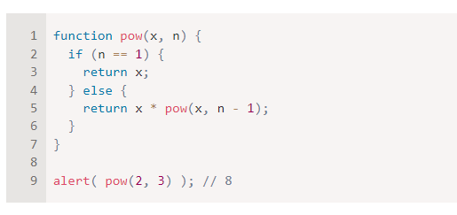
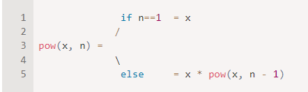
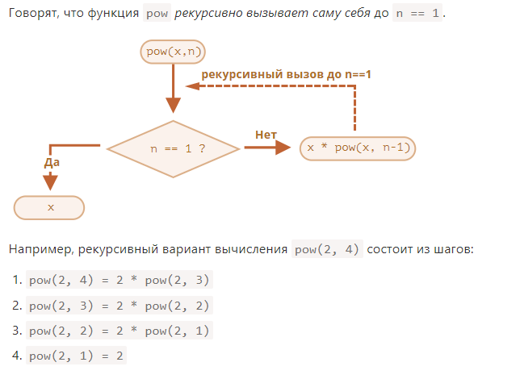
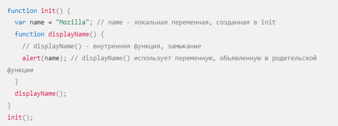

# FirstLecture

## JavaScript

(JS) является динамическим языком программирования. Термин "динамический" в контексте языков программирования обычно относится к нескольким ключевым характеристикам:

## Динамическая типизация

В JavaScript тип переменной определяется во время выполнения программы, а не заранее при её объявлении. Это означает, что переменные могут принимать значения различных типов данных в разное время. Например, переменная, которая сначала содержала строку, может позже хранить число, объект или любой другой тип данных.

## РОЛЬ JAVASCRIPT В ВЕБ-РАЗРАБОТКЕ

JavaScript (JS) – это язык программирования, который играет ключевую роль в современной веб-разработке. Он используется для создания интерактивных веб-страниц и веб-приложений, которые могут реагировать на действия пользователя и динамически обновлять контент.

### для объявления переменных используются ключевые слова

- var
- let
- const

var - (устаревший, избегайте его использования) (внутри функции или глобальная для всего скрипта).

let- Область видимости: Блоковая (внутри блока кода, например, внутри функции или цикла).Нет, нельзя снова объявить переменную с тем же именем в том же блоке.В JavaScript существуют два основных типа данных:

const-Область видимости: Блоковая (внутри блока кода, например, внутри функции или цикла).
Возможность повторного объявления: Нет, нельзя снова объявить переменную с тем же именем в том же блоке.
Возможность изменения значения: Нет, значение переменной нельзя менять после ее объявления.

### В JavaScript существуют два основных типа данных:

- Примитивы:
- объект

#### Примитивы:

- boolean (булево): true или false.
- number (число): целое или дробное.
- string (строка): текст.
- null: отсутствие значения.
- undefined: неопределенное значение.
- symbol: уникальный неизменяемый тип.

#### объект:

- object (объект): коллекция ключей и значений.
- array (массив): упорядоченная коллекция значений.
- function (функция): код, который можно выполнить.

##Операторы в JavaScript

Операторы - это специальные символы или слова, которые используются для выполнения операций над значениями. JavaScript имеет богатый набор операторов, которые можно разделить на несколько категорий:

- Арифметические операторы:
- Логические операторы:
- Операторы присваивания:
- Операторы инкремента и декремента:
- Операторы цикла:

  # Три важные темы в JS

- Условия
- Циклы
- Фуекция

#### Условия

В JavaScript используются различные конструкции для проверки условий и выполнения различных действий в зависимости от результата проверки.

Основные конструкции:

- if
- if eles
- switch
- Тернарный оператор:
- Логические операторы:

#### Циклы

Циклы используются для многократного выполнения кода.

Существуют следующие виды циклов:

- for
- while
- do...while

#### Фуекция

Функции являются одними из основных строительных блоков JavaScript. Они позволяют группировать код, который можно вызывать по имени, предоставляя возможности повторного использования, структурирования и модульности.

Функции в JavaScript
Функции являются одними из основных строительных блоков JavaScript. Они позволяют группировать код, который можно вызывать по имени, предоставляя возможности повторного использования, структурирования и модульности.

Основные понятия:
Объявление: Используется ключевое слово function для объявления функции. Имя функции выбирается вами.
Параметры: Функции могут принимать параметры, которые представляют собой входящие данные для функции.
Тело функции: Это блок кода, который выполняется при вызове функции.
Возвращаемое значение: Функции могут возвращать значения с помощью ключевого слова return.

три вид функции в js

- FUNCTION Declaration
- FUNCTION expression
- FUNCTION iife

  # рекурсия

javascript имеет свойство, которое называется рекурсией - это способ написания программы таким образом, чтобы она сама себя вызывала.
Функция, которая в своем теле вызывает сама себя, называется рекурсивной функцией.

function factorial(n){
if (n === 1){ (АГАР МО АМИНЧАДА УСЛОВИЯ НАТИЕМ ФУЕКЦМОН БИСКАНЧЕНИ МЕРАВАОД)
return 1; (ИЧАДА УЛОВА АГАР БА 1 БАРАОБА ШУД АМИН РИТУРН ФУНКЦАРО МАХКАМ МЕКНАД)
}
else{

        return n * factorial(n - 1) ( АРУД ИД ОСНАВНЙ КОД  КОР КИХТ   n * factorial(n - 1) ДАМ N -1 ИВИ КАМ КИХТ ТО ПИТИР УСЛОВИ ЕЦ );
    }

}
const result = factorial(4); (ЮДЕ Я АР МАМ РЕЗАЛТ ПЕРМЕН ИД ФУНКЦ ВЕВЧЕН)
console.log(result)

### Рекурсивный способ: упрощение задачи и вызов функцией самой себя:

Обратите внимание, что рекурсивный вариант отличается принципиально.

Когда функция pow(x, n) вызывается, исполнение делится на две ветви:

# Замыкания

##### (Замыкание — это комбинация функции и лексического окружения, в котором эта функция была определена. Другими словами, замыкание даёт вам доступ к Scope (en-US) внешней функции из внутренней функции. В JavaScript замыкания создаются каждый раз при создании функции, во время её создания.)

init() создаёт локальную переменную name и определяет функцию displayName(). displayName() — это внутренняя функция — она определена внутри init() и доступна только внутри тела функции init(). Обратите внимание, что функция displayName() не имеет никаких собственных локальных переменных. Однако, поскольку внутренние функции имеют доступ к переменным внешних функций, displayName() может иметь доступ к переменной name, объявленной в родительской функции init().

Причина в том, что функции в JavaScript формируют так называемые замыкания. Замыкание — это комбинация функции и лексического окружения, в котором эта функция была объявлена. Это окружение состоит из произвольного количества локальных переменных, которые были в области действия функции во время создания замыкания. В рассмотренном примере myFunc — это ссылка на экземпляр функции displayName, созданной в результате выполнения makeFunc. Экземпляр функции displayName в свою очередь сохраняет ссылку на своё лексическое окружение, в котором есть переменная name. По этой причине, когда происходит вызов функции myFunc, переменная name остаётся доступной для использования и сохранённый в ней текст "Mozilla" передаётся в alert.